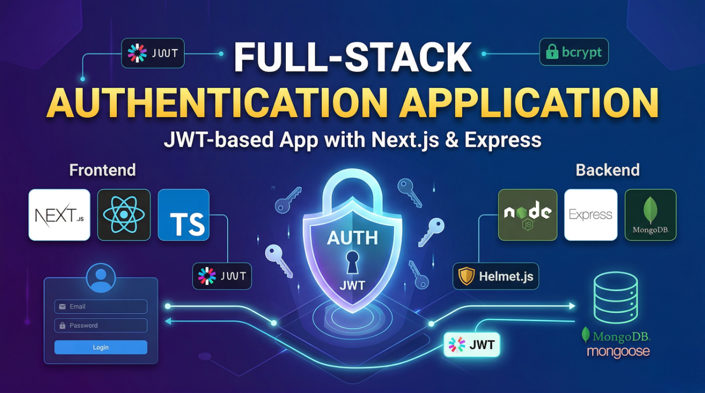

# Full-Stack Authentication Application



A modern full-stack web application with JWT-based authentication, built with Next.js and Express.

## Tech Stack

### Frontend
- **Next.js 16** - React framework with App Router
- **React 19** - UI library
- **TypeScript** - Type safety
- **Tailwind CSS 4** - Styling

### Backend
- **Node.js** with **Express 5** - Server framework
- **MongoDB** with **Mongoose** - Database
- **JWT** - Authentication tokens
- **bcrypt** - Password hashing

### Security Features
- Helmet.js for security headers
- CORS configuration
- Rate limiting
- Cookie-based authentication
- Request validation with express-validator
- Body size limits

### Environment Variables

The `.env` file in the root directory contains:

```env
# Server Configuration
SERVER_PORT=3000
NODE_ENV=development
FRONTEND_URL=http://localhost:3001

# Database
MONGOOSE_URI=mongodb://localhost:27017/jwt-auth

# JWT Secrets (Change in production!)
JWT_SECRET=your-secret-key
JWT_REFRESH_SECRET=your-refresh-secret-key
JWT_ACCESS_EXPIRY=15m
JWT_REFRESH_EXPIRY=7d
```

**Important:** Generate new JWT secrets for production using:
```bash
node -e "console.log(require('crypto').randomBytes(64).toString('hex'))"
```

## Features

- User registration and authentication
- JWT-based session management
- Protected routes with middleware
- Rate limiting to prevent abuse
- Secure password hashing
- Cookie-based token storage
- Responsive UI with Tailwind CSS
- TypeScript for type safety

## API Endpoints

### User Routes
- `POST /api/users/register` - Register new user
- `POST /api/users/login` - User login
- `GET /api/users/profile` - Get user profile (protected)
- `POST /api/users/logout` - User logout

## Security Considerations

- JWT secrets should be strong and unique in production
- CORS is configured to allow only specified origins
- Rate limiting prevents brute force attacks
- Helmet.js adds security headers
- Request body size is limited to 10kb
- Passwords are hashed with bcrypt
- HTTP-only cookies for token storage

## License

ISC